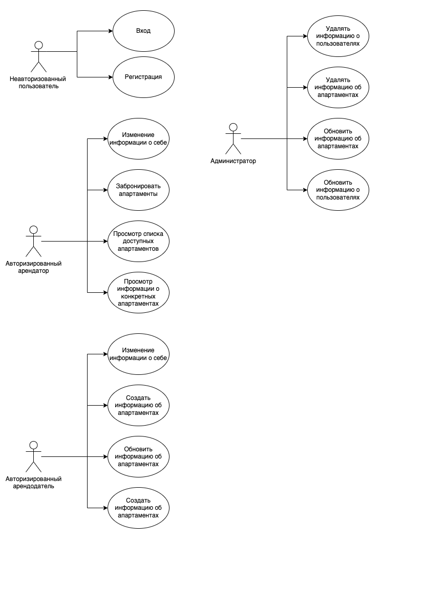
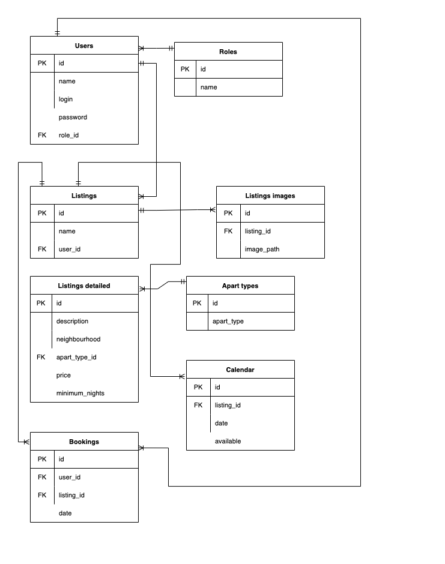

# Сервис для поиска и аренды жилья 

### 1. Use-Case

### 2. ER-диаграмма

### 3. Функциональные требования

1. Посетитель сайта может зарегистрироваться или зайти в систему.
2. Авторизированный арендатор может просматривать объявления и информацию о них, выложенные арендодателем, а также забранировать апартаменты, может изменить персональную информацию о себе.
3. Авторизированный арендодатель может создавать, удалять и обновлять объявления о предоставляемых апартаментах, может изменить персональную информацию о себе.
4. Администраторы сервиса могут удалять и модифицировать информацию о доступных апартаментах и пользователях.

### 4. Экраны будущего приложения

